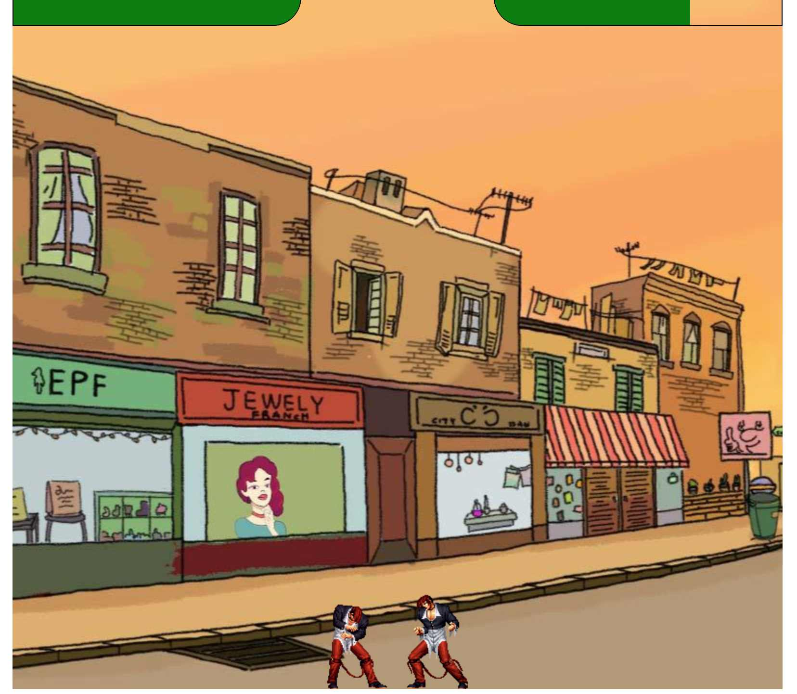
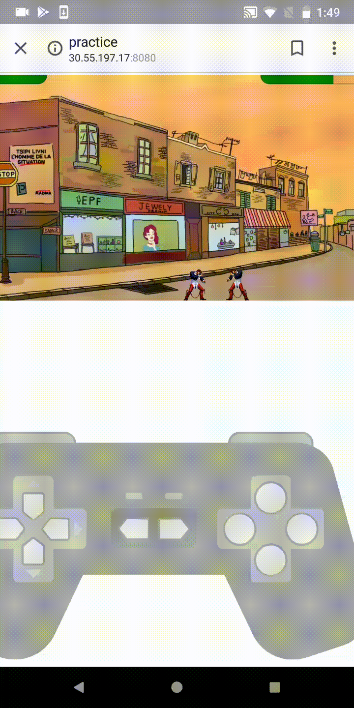
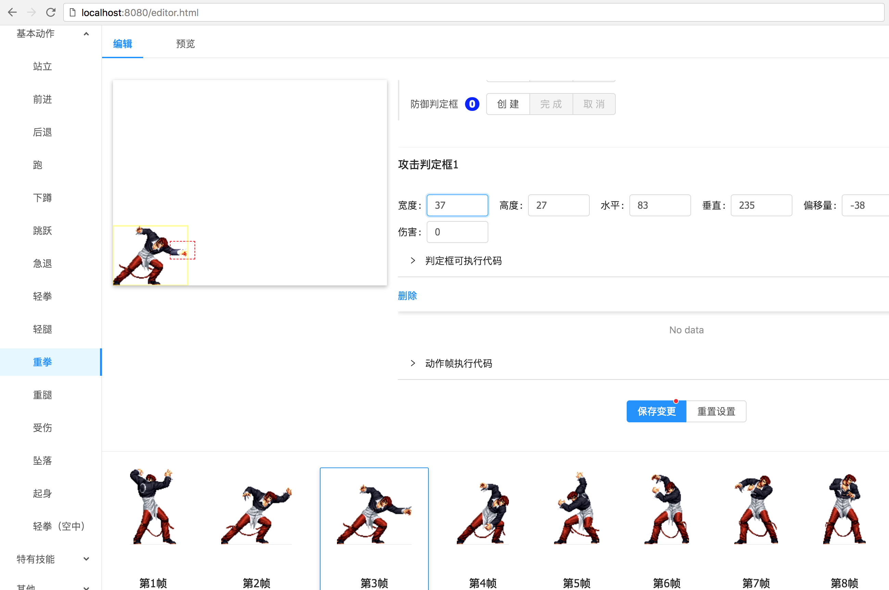

# 2D格斗游戏引擎 / 2D FighT Game Engine

# 特点 / Feature
* 基于Canvas绘图 based on Canvas
* 同时支持桌面和移动端 Support both desktop browser & mobile (any container support canvas)
* 支持自定义新角色 Support user defined new character
* 支持发布角色（未来支持功能）Support publish new character to chracter gallery
* 支持加载第三方角色信息 support load character from chracter gallery
* 桌面端使用键盘操作，移动端使用虚拟手柄 use keyboard on desktop and virtual joystick on mobile
* 游戏编辑器功能（未来支持） game editor to create new characters/ new games...
* 更多敬请期待... more to be expected

# 预览 / preview







# 尝试 / taste
## 本地启动服务

代码克隆后执行如下命令 git clone & execute script
```
npm i && npm run dev
```
一般服务器会启动在 After server launched successfully please visit http://localhost:8080/

## 游戏操作 / Game Operations
使用键盘操作时，上下左右是wsad，ABCD的按键分别是jkl;

When using keyboard, 'wsad' controls up/down/lef/right/,  and 'jkl;' are regarded as 'ABCD'

## 出招表 / Skill sheet

### 八神庙 / Iori
驱炎弹 ↓→A/C

葵花   ↓←A/C

必杀技  ↓A

# GitHub
https://github.com/hoyt-tian/FEngine

# 贡献代码 / Contribution
如果你也想参与2D游戏引擎的开发完善工作，请邮件与我联系（见github信息）
If you'd like to contribute to this project, please contact me by email(See my github profile)

# 图片资源 / Image Resources
http://oss.emugif.com/picture2014/kof97/chars.htm